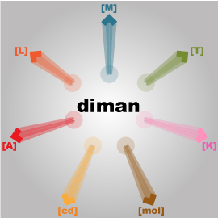

# diman

[](https://clojars.org/com.neuralgraphs/diman)

A Clojure library for applying dimensional analysis.

[Motivation for diman.](./doc/ProjectPlan.pdf)

## Current Features

- Create dimensional formulae.
- Create dimensional equations.
- Implement principle of dimensional homogeneity; Perform consistency checks.
- Derive dimensionless products.

## Usage

The easiest way to get all the built-in functions is to be in the default namespace `(in-ns 'diman.default)`. Then, `(println default-functions)` to list all the available functions. 

- Tutorial: Generate dimensional formulae and perform consistency checking; [AsciiDoc](./doc/tutorial1.adoc), [reStructuredText for Bitbucket](./doc/tutorial1.rst)
- Tutorial: Derive dimensionless products; [AsciiDoc](./doc/tutorial2.adoc), [reStructuredText for Bitbucket](./doc/tutorial2.rst)
- Example: Journal Bearing; [AsciiDoc](./doc/tutorial3.adoc), [reStructuredText for Bitbucket](./doc/tutorial3.rst)
- Rationale for the seven base dimensions; [AsciiDoc](./doc/rationale1.adoc), [reStructuredText for Bitbucket](./doc/rationale1.rst)
- Rationale for implementing the steps for deriving a complete set of dimensionless products; [AsciiDoc](./doc/rationale2.adoc), [reStructuredText for Bitbucket](./doc/rationale2.rst)
- [Source code documentation](https://cljdoc.org/d/com.neuralgraphs/diman)

### For Clojure Noobs

Since [Leiningen](https://leiningen.org/) is one of the easiest way to use Clojure, I recommend using Leiningen to run diman. Once Leiningen is installed you can use diman in two ways; by cloning this diman repo and starting up a repl ([Read-eval-print loop](https://en.wikipedia.org/wiki/Read%E2%80%93eval%E2%80%93print_loop)) inside the cloned directory `cd ~/diman`, and by making diman as a dependency to your clojure project.

#### 1. Running diman by cloning the repo

Once you have cloned the repository do `cd ~/path/to/diman`, then
```
lein repl
```

By default you should already be in the **default namespace**, that is, there is no need to `(in-ns 'diman.default)`. To list all the essential functions (and therefore all the functions for the tutorials) do `(println default-functions)`.

#### 2. Running diman as a dependency (recommended)

Assuming you already have a clojure project or you can create one with the command `lein new <project-name>`, then diman can be added as a dependency in the `project.clj` file by doing
```
...
:dependencies [[org.clojure/clojure "1.10.3"]
               [com.neuralgraphs/diman "x.y.z"]]
...
```

To go through the tutorials, startup a repl (`lein repl`) inside the created project (`cd /path/to/<project-name>`) load the diman libraries as follows
```
(require '[diman.dimensions :refer [base_dimensions standard_formula update-sformula]]
         '[diman.formula :refer [formula-term formula-eqn-side formula-eqn-side-manifold]]
         '[diman.analyze :refer [dimnames consistent?]]
         '[diman.buckingham [dimensional-matrix :refer [generate-dimmat]]
                            [homogeneous-equation :refer [get-augmented-matrix solve get-solution-matrix]]
                            [dimensionless-product :refer [get-dimensionless-products get-pi-expression]]]
         '[diman [core :refer [view-matrix]]]
         '[diman.linalg.matfun [rank :refer [rank]]])
```

These are all the diman libraries essential for dimensional analysis (you may copy-paste the above inside the repl).

To load specific diman libraries in specific namespace under the new project do
```
(ns <project-name>.<your-namespace>
  (:require [diman.analyze :refer [dimnames consistent?]]))
```

## Contributing to diman

Thank you for your interest in contributing to diman.
Please refer to the [guidelines](./doc/zCONTRIBUTING.adoc) on how to contribute.

## Publications

* [](https://doi.org/10.21105/joss.03735)


## License

Copyright © 2021 Lungsi Ngwua

Distributed under BSD 3-Clause "New" or "Revised" License.
