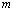
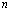
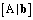
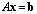
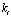

==========================================================================================
Rationale for implementing the steps for deriving a complete set of dimensionless products
==========================================================================================

The rationale for the derivation of a complete set dimensionless product is based on Buckingham's theorem [Ngwua2021]_. Langhaar provides an excellent guide on the systematic calculation [Langhaar1951]_. There are some minor difference in implementing the derivation steps in diman. Aside from the programmatic implementation for generating the dimensional matrix and returning the dimensionless products in its expression form the uniqueness in diman is in the steps for solving the homogeneous equation.

The typical approach to solving the system of homogeneous equation is followed by a substitution step which would then result in the solution matrix of the complete set of dimensionless products. In diman the substitution step is incorporated into the solving process. This is due to the combination of constructing an augmented matrix and using a modified Gaussian elimation process that returns a reduced row-echelon form of the augmented matrix. However, although this results in all the ingredients for the solution matrix the reduced row enchelon form is not the solution matrix. An additional step is required to obtain the solution matrix from the reduced row-echelon form of the augmented matrix.

Constructing the Dimensional Matrix
===================================

Create a matrix such that its entries are the exponents of the base dimensions. A row stands for a base dimension and a column stands for a quantity in |f|. Therefore, the size of the dimensional matrix is such that the number of rows is the number of base dimensions needed to derive all the quantities in |f| and the number of columns is the number of quantities in |f|, the number of independent variable for |f|.

The Dimensional Matrix and the System of Homogeneous Equations
--------------------------------------------------------------

The row entries of a dimensional matrix may be considered the coefficients of a homogeneous equation such that the unknown variables of the equation represent exponents of respective quantities, the independent variables of |f|. The resulting product of all the quantities with their respective exponents (the unknown variables of the homogeneous equation) is a dimensionless product.

Since each row of a dimensional matrix may be representative of a homogeneous equation, it follows that a dimensional matrix will represent a system of homogeneous equation.

Solving the Homogeneous Equation
================================

In diman the first step towards solving the system of homogeneous equations is to construct the augmented matrix.

Constructing the Augmented Matrix
---------------------------------

The term augmented matrix to most people will invoke the matrix |A_b| for the linear system |Ax_b|. Since our system is a system of homogeneous equation our augmented matrix is not the same as |A_b|. It is an augmentation of the dimensional matrix such that blocks of the matrix is rearranged.

How are the two blocks rearranged?
~~~~~~~~~~~~~~~~~~~~~~~~~~~~~~~~~~

A arbitrary dimensional matrix |m| times |n| is partitioned into two blocks which are then shifted from tail-block to head-block and head-block to tail-block. Therefore, the dimensional and the augmented matrix have the same size.

The basic idea is that the augmented matrix has at its head section (initial columns of the matrix) the m by m block taken from the tail of the dimensional matrix. The remaining part of the augmented matrix is the rest of the head of the dimensional matrix multiplied by the scalar -1. Thus, the signs for every entry of the m by m block taken from the tail remain unchanged while the sign of the entries of the remaining block of the dimensional matrix is reversed when they become part of the augmented matrix.

Below is the pseudocode for constructing the augmented matrix.

::

    START
        D <- dimensional matrix
        m <- number of rows of D
        n <- number of columns of D
        r <- rank of D
        p <- n - r
        Dsub_LHS <- D(rows 1 to m, columns 1 to p) size is m x p
        Dsub_RHS <- D(rows 1 to m, columns p+1 to n) size is m x r
        Augmented matrix <- [Dsub_RHS | (-1)*Dsub_LHS] size is m x (p + r)
    STOP

Using Modified Gaussian Elimination Method to Solve the System of Homogeneous Equations
---------------------------------------------------------------------------------------

A modified Gaussian elimation method is used such that the |m| times |m| block at the head of the augmented matrix becomes an identity matrix. The diagonal of the identity block matrix represents the left hand side of the solution for the last |m| |k_i|'s (there are |n| |k_i|'s). In other words, the returned matrix is the **reduced row-echelon form** of the augmented matrix. But, this matrix is not the solution matrix, the solution matrix for complete set of dimensionless products.

Getting the Solution Matrix
===========================

The solution matrix for a complete set of dimensionless products is determined from the solution of the augmented matrix such that the number of rows of the solution matrix is the number of dimensionless products in the set and the number of columns is the number of quantities in |f|, the number of independent variable for |f|. Below shows the pseudocode for getting the solution matrix.

::

    START
        AugS <- solved augmented matrix
        A <- strip zero rows from AugS
        m <- number of rows of A
        n <- number of columns of A
        Asub <- A(rows 1 to m, columns m+1 to n) size is m x (n - m)
        Asub_tr <- Asub transpose size is (n - m) x m
        I <- identity matrix of size (n - m) x (n - m)
        Solution matrix <- [ I | Asub_tr ] size is (n - m) x n
    STOP

References
==========

.. [Langhaar1951] Langhaar, H. L. (1951). Systematic Calculation of Dimensionless Products. In *Dimensional Analysis and Theory of Models* (pp. 29-46). John Wiley & Sons, Inc.
.. [Ngwua2021] Ngwua, L. (2021, July 4). *Theory of Dimensionless Products*. NeuralGraphs. `<https://www.neuralgraphs.com/lectures/diman/lectp8.html>`_.

.. |f| image:: ../resources/math/f.gif

