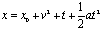
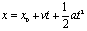
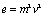
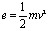
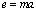
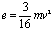
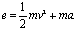
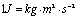

==============================================================
Generate dimensional formulae and perform consistency checking
==============================================================

This introduction will teach how to

* generate dimensional formulae
* generate consistency checks
* standardize correct equation

How to Generate Dimensional Formulae
====================================

1. The Problem
--------------

Imagine you derived the equation below based on the experimental observations

You want to know if this derived equation is correct. Using **diman** you can perform a *preliminary check with consistency analysis*. But before you can check for dimensional consistency you need to set it up for the analysis.

2. Setting Up for Generation
----------------------------

2.1. Definitions setup
~~~~~~~~~~~~~~~~~~~~~~

Define all the symbols in the mathematical expression that is associated with a dimension.

::

    (def varpars [{:symbol "x", :quantity "length"}
                  {:symbol "v", :quantity "velocity"}
                  {:symbol "t", :quantity "time"}
                  {:symbol "a", :quantity "acceleration"}])

2.2. Expressions and equation
~~~~~~~~~~~~~~~~~~~~~~~~~~~~~

Next, define the equation in terms of its left and right hand side of the expression. If a side has more than one term they are expressed as a map with appropriate key ``:termi`` for respective term.

::

    (def lhs "x^(1)")
    (def rhs {:term1 "x^(1)",
              :term2 "v^(2)",
              :term3 "t^(1)",
              :term4 "0.5*a^(1)*t^(2)"})
    (def eqn {:lhs lhs, :rhs rhs})

3. Getting the Dimensional Formula
----------------------------------

The equation defined above is used for deriving the dimensional formula.

3.1. Sub-formula of the dimensional formula for one side of the equation
~~~~~~~~~~~~~~~~~~~~~~~~~~~~~~~~~~~~~~~~~~~~~~~~~~~~~~~~~~~~~~~~~~~~~~~~

For the side of the equation that contains multiple terms the *sub-formula* is the dimensional formula for one of the terms. Notice that the sub-formula **IS** the dimensional formula for the expression if there is just one term.

Thus for the right hand side of the given equation (which was defined in the previous section)

::

    => rhs
    {:term1 "x^(1)", :term2 "v^(2)", :term3 "t^(1)", :term4 "0.5*a^(1)*t^(2)"}

the dimensional formula for ``:term4`` is given by

::

    => (formula-term varpars (:term4 rhs))
    "[T^(0)*L^(1)]"

3.2. Dimensional formula for one side of the equation
~~~~~~~~~~~~~~~~~~~~~~~~~~~~~~~~~~~~~~~~~~~~~~~~~~~~~

Dimensional formula for one side of the expression regardless of the number of terms in it can be generated using the ``formula-eqn-side`` function.

Dimensional formula for the ``rhs`` expression is given by

::

    => (formula-eqn-side varpars rhs)
    "[L^(1)] + [T^(-2)*L^(2)] + [T^(1)] + [T^(0)*L^(1)]"

3.3. Introspecting the dimensional formula
~~~~~~~~~~~~~~~~~~~~~~~~~~~~~~~~~~~~~~~~~~

3.3.1. Represent sub-formula of an expression term as dimension names
+++++++++++++++++++++++++++++++++++++++++++++++++++++++++++++++++++++

::

    => (dimnames (formula-term varpars (:term4 rhs)))
    "length^(1)"

3.3.2. Represent dimensional formula of an equation side as dimension names
+++++++++++++++++++++++++++++++++++++++++++++++++++++++++++++++++++++++++++

::

    => (dimnames (formula-eqn-side varpars rhs))
    "length^(1) + time^(-2)*length^(2) + time^(1) + length^(1)"

How to do Consistency Checks
============================

1. The Problem
--------------

Consider the equation

2. Setting Up for Checking
--------------------------

2.1. Definitions setup
~~~~~~~~~~~~~~~~~~~~~~

Define all the symbols in the mathematical expression that is associated with a dimension.

::

    (def varpars [{:symbol "x", :quantity "length"}
                  {:symbol "v", :quantity "velocity"}
                  {:symbol "t", :quantity "time"}
                  {:symbol "a", :quantity "acceleration"}])

2.2. Expressions and equation
~~~~~~~~~~~~~~~~~~~~~~~~~~~~~

Next, define the equation in terms of its left and right hand side of the expression. If a side has more than one term they are expressed as a map with appropriate key ``:termi`` for respective term.

::

    (def lhs "x^(1)")
    (def rhs {:term1 "x^(1)",
              :term2 "v^(1)*t^(1)",
              :term3 "0.5*a^(1)*t^(2)"})
    (def eqn {:lhs lhs, :rhs rhs})

3. Perform Consistency Check
----------------------------

If the correctness of an equation is in doubt checking for dimensional consistency is a useful preliminary step.

To perform consistency check based on dimensional analysis in diman (c) you use the predicate function ``consistent?``. Thus, for the given problem

::

    => (consistent? varpars eqn)
    true

However, dimensionally consistent equation **does not guarantee** correct equation.

4. Consistency of multiple equations
------------------------------------

Let us consider the case of a problem where one derives multiple expressions thought to be potential candidates for representing the problem.

the question is, **which of these equations are correct?** To tackle this question let us first look at the answer for *which of these equations are dimensionally correct?* In other words, let us perform dimensional consistency checks on each expression.

Thus

+---------------------------------------------------------------+--------------------------------------------------------------------------------------+
| Equation                                                      | Setup                                                                                |
+===============================================================+======================================================================================+
| .. image:: ../resources/math/tutorial1_e_m2v2.gif             | ``(def eqn1 {:lhs "e^(1)", :rhs "m^(2)*v^(2)"})``                                    |
+---------------------------------------------------------------+--------------------------------------------------------------------------------------+
| .. image:: ../resources/math/tutorial1_e_half_mv2.gif         | ``(def eqn2 {:lhs "e^(1)", :rhs "0.5*m^(1)*v^(2)"})``                                |
+---------------------------------------------------------------+--------------------------------------------------------------------------------------+
| .. image:: ../resources/math/tutorial1_e_ma.gif               | ``(def eqn3 {:lhs "e^(1)", :rhs "m^(1)*a^(1)"})``                                    |
+---------------------------------------------------------------+--------------------------------------------------------------------------------------+
| .. image:: ../resources/math/tutorial1_e_3by16_mv2.gif        | ``(def eqn4 {:lhs "e^(1)", :rhs "0.1875*m^(1)*v^(2)"})``                             |
+---------------------------------------------------------------+--------------------------------------------------------------------------------------+
| .. image:: ../resources/math/tutorial1_e_half_mv2_plus_ma.gif | ``(def eqn5 {:lhs "e^(1)", :rhs {:term1 "0.5*m^(1)*v^(2)", :term2 "m^(1)*a^(1)"}})`` |
+---------------------------------------------------------------+--------------------------------------------------------------------------------------+

and define the variables/parameters as

::

    (def varpars [{:symbol "e", :quantity "energy"}
                  {:symbol "m", :quantity "mass"}
                  {:symbol "v", :quantity "velocity"}
                  {:symbol "a", :quantity "acceleration"}])

Then

::

    => (consistent? varpars eqn1)
    false
    => (consistent? varpars eqn2)
    true
    => (consistent? varpars eqn3)
    false
    => (consistent? varpars eqn4)
    true
    => (consistent? varpars eqn5)
    false

which suggests |e_half_mv2| and |e_3by16_mv2| to be dimensionally consistent.

But both equations can't be correct, illustrating the point that

    a dimensionally consistent equation does not guarantee correct equation

How to Standardize the Correct Equation
=======================================

From the previous example of notice that kinetic ``"e"`` is not defined in the ``standard_formula``

::

    => (pprint standard_formula)
    [{:quantity "volume", :dimension "[L^(3)]"}
    {:quantity "velocity", :dimension "[L^(1)*T^(-1)]"}
    {:quantity "acceleration", :dimension "[L^(1)*T^(-2)]"}
    {:quantity "force", :dimension "[M^(1)*L^(1)*T^(-2)]"}
    {:quantity "mass density", :dimension "[M^(1)*L^(-3)]"}]

Since we already know that the kinetic energy is in Joules and |1Joule| whose dimensional formula is ``"[M^(1)*L^(2)*T(-2)]"`` this can be added to the ``standard_formula`` as

::

    => (update-sformula [{:quantity "energy", :dimension "[M^(1)*L^(2)*T(-2)]"}])
    [{:quantity "volume", :dimension "[M^(0)*L^(3)*T^(0)]"}
    {:quantity "velocity", :dimension "[M^(0)*L^(1)*T^(-1)]"}
    {:quantity "acceleration", :dimension "[M^(0)*L^(1)*T^(-2)]"}
    {:quantity "force", :dimension "[M^(1)*L^(1)*T^(-2)]"}
    {:quantity "mass density", :dimension "[M^(1)*L^(-3)*T^(0)]"}
    {:quantity "energy", :dimension "[M^(1)*L^(2)*T(-2)]"}]

Now since ``"energy"`` is one of the ``:quantity`` in the ``standard_formula``, we can now add the symbol ``"e"`` in our definition as follows

::

    => (def varpars (conj varpars {:symbol "e", :quantity "energy"}))
    => (pprint varpars)
    [{:symbol "m", :quantity "mass"}
    {:symbol "v", :quantity "velocity"}
    {:symbol "a", :quantity "acceleration"}
    {:symbol "e", :quantity "energy"}]

