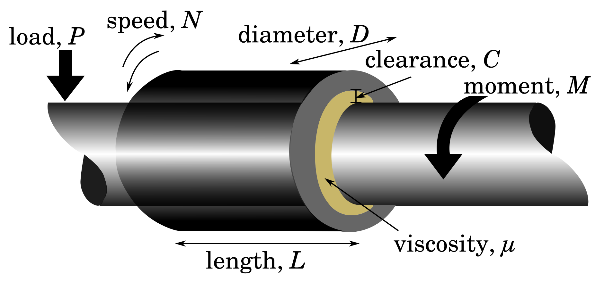

= Example: Journal Bearing

If one were interested in studying the frictional coefficient _f_
of the bearing, then we must consider
the variables/parameters that may influence it.

* bearing length, _L_
* bearing diameter, _D_
* bearing load, _P_
** The load on the bearing is represented in terms of the average
bearing pressure _P_ = _W_/(_LD_) where _W_ is the actual load of bearing.
* rotating speed, _N_
** Assume that the resulting rotating speed of the bearing is the
constant average speed _N_.
* viscosity of lubricating oil, _&mu;_
** This is the viscosity at equillibrium temperature &mdash; the bearing
rotating at an average of _N_ produces heat
which is conducts and convects.
* clearance between bearing and journal, _C_
* bearing moment, _M_
** Load applied to the shaft passing through the bearing results in
bearing moment.

We can therefore start our study with the assumption that the frictional
coefficient of the bearing is a function of the above seven variables resulting in
the function value _f_ (_L_, _D_, _P_, _N_, _&mu;_, _C_, _M_).

But, _L_, _D_ and _C_ have the same dimensions. Then, _L_/_D_ and _C_/_D_
are dimensionless. Therefore, if we temporarily disregard the variables _L_
and _C_, then we can reduce seven variables to five.

Hence, the tentative function for the derivation is such that its value is given by

_f_(_D_, _P_, _N_, _&mu;_, _M_)

Since,

[width="88%",cols="29%,25%,26%,20%",options="header",]
|===
|quantity symbol |quantity name |unit (say, SI) |dimensions
|  _P_  | pressure |_Pa_ = _kg_/_ms_^2^ | _M_/(_LT_^2^)

|_M_ | moment
|__N__&sdot;__m__ = ((__kg__&sdot;__m__)/_s_^2^)_m_
|_ML_^2^/_T_^2^

|_D_ | diameter | _m_ |_L_

|_&mu;_ | viscosity
| __Pa__&sdot;__s__ = (_kg_/_ms_^2^)_s_
|_M_/_LT_

|_N_ | speed | 1/_s_ | 1/_T_
|===

the dimensional system for the problem is _MLT_-system.

We can now proceed with the steps (four) for deriving the dimensionless
products.

== 1. Generate Dimensional Formula for All the Terms

The derivation of the dimensionless products will be based on the reduced _f_ where
the parent function depends on the independent five variables. The generation of
the dimensional matrix is follows some preceding setup steps.

=== 1.1. Setup for Generation

==== 1.1.1. Definitions setup

Since our problem uses _MLT_ dimensional system

....
(def varpars [{:symbol "x", :quantity "mass"}
              {:symbol "y", :quantity "length"}
              {:symbol "t", :quantity "time"}])
....

==== 1.1.2. Expressions and equation

We express the variables for the unknown function _f_ as

....
(def manifold_eqn [{:name "term-P", :eqn {:term1 "x^(1)*y^(-1)*t^(-2)"}}
                   {:name "term-M", :eqn {:term1 "x^(1)*y^(2)*t^(-2)"}}
                   {:name "term-D", :eqn {:term1 "y^(1)"}}
                   {:name "term-mu", :eqn {:term1 "x^(1)*y^(-1)*t^(-1)"}}
                   {:name "term-N", :eqn {:term1 "t^(-1)"}}])
....

=== 1.2. Getting the Dimensional Formula

The dimensional formula all the terms are

....
=> (pprint (formula-eqn-side-manifold varpars manifold_eqn))
  [{:quantity "term-P", :dimension "[M^(1)*T^(-2)*L^(-1)]"}
   {:quantity "term-M", :dimension "[M^(1)*T^(-2)*L^(2)]"}
   {:quantity "term-D", :dimension "[L^(1)]"}
   {:quantity "term-mu", :dimension "[M^(1)*T^(-1)*L^(-1)]"}
   {:quantity "term-N", :dimension "[T^(-1)]"}]
....

=== 1.3 Standardize All the Generated Dimensional Formula

We add the above dimensional formulae into the
[.title-ref]#standard_formula#

....
=> (update-sformula (formula-eqn-side-manifold varpars manifold_eqn))
  [{:quantity "volume", :dimension "[L^(3)]"}
   {:quantity "frequency", :dimension "[T^(-1)]"}
   {:quantity "velocity", :dimension "[L^(1)*T^(-1)]"}
   {:quantity "acceleration", :dimension "[L^(1)*T^(-2)]"}
   {:quantity "force", :dimension "[M^(1)*L^(1)*T^(-2)]"}
   ...
   {:quantity "term-N", :dimension "[T^(-1)]"}
   {:quantity "term-mu", :dimension "[M^(1)*T^(-1)*L^(-1)]"}
   {:quantity "term-D", :dimension "[L^(1)]"}
   {:quantity "term-M", :dimension "[M^(1)*T^(-2)*L^(2)]"}
   {:quantity "term-P", :dimension "[M^(1)*T^(-2)*L^(-1)]"}]
....

=== 1.4. Definitions setup for dimensional matrix

....
(def varpars2 [{:symbol "P", :quantity "term-P"}
               {:symbol "M", :quantity "term-M"}
               {:symbol "D", :quantity "term-D"}
               {:symbol "mu", :quantity "term-mu"}
               {:symbol "N", :quantity "term-N"}])
....

== 2. Generate Dimensional Matrix

....
=> (view-matrix (generate-dimmat varpars2))
  [-1N 2N 1N -1N 0]
  [-2N -2N 0 -1N -1N]
  [1N 1N 0 1N 0]
  Size -> 3 x 5
....

== 3. Get the Homogeneous equation of the Dimensional Matrix

=== 3.1. Get the augmented matrix of the dimensional matrix

....
=> (view-matrix (get-augmented-matrix (generate-dimmat varpars2)))
  [1N -1N 0 1N -2N]
  [0 -1N -1N 2N 2N]
  [0 1N 0 -1N -1N]
  Size -> 3 x 5
....

=== 3.2. Solve the augmented matrix

....
=> (view-matrix (solve (get-augmented-matrix (generate-dimmat varpars2))))
  [1N 0N 0N 0N -3N]
  [0 1N 0N -1N -1N]
  [0 0N 1N -1N -1N]
  Size -> 3 x 5
....

=== 3.3. Get the solution matrix

....
=> (view-matrix (get-solved-matrix (solve (get-augmented-matrix (generate-dimmat varpars2)))))
  [1 0 0N -1N -1N]
  [0 1 -3N -1N -1N]
  Size -> 2 x 5
....

This is a 2 &times; 5 matrix. Therefore, two dimensionless products will
be derived.

We can put all these individual steps involving matrix into one coding
step such that it returns the solution matrix.

....
=> (def solution_matrix (get-solved-matrix
                            (solve
                                (get-augmented-matrix
                                    (generate-dimmat varpars2)))))
=> (view-matrix solution_matrix)
  [1 0 0N -1N -1N]
  [0 1 -3N -1N -1N]
  Size -> 2 x 5
....

== 4. Get Dimensionless Products

....
=> (def all-dimless (get-dimensionless-products solution_matrix varpars2))

=> (pprint all-dimless)
  [{:symbol "pi0", :expression "P^(1)*mu^(-1)*N^(-1)"}
   {:symbol "pi1", :expression "M^(1)*D^(-3)*mu^(-1)*N^(-1)"}]

=> (get-pi-expression all-dimless "pi0")
  "P^(1)*mu^(-1)*N^(-1)"
....

Note that these two dimensionless products are derived from the
tentative function _f_ where we temporarily disregarded _L_/_D_ and _C_/_D_.

But, _L_/_D_ and _C_/_D_ are dimensionless. Therefore, the
number of products in the complete set of dimensionless products is
four. Hence, the frictional coefficient has the value

_f_~1~(_P_/(_&mu;N_), _M_/(_D_^3^_&mu;N_), _L_/_D_, _C_/_D_).
